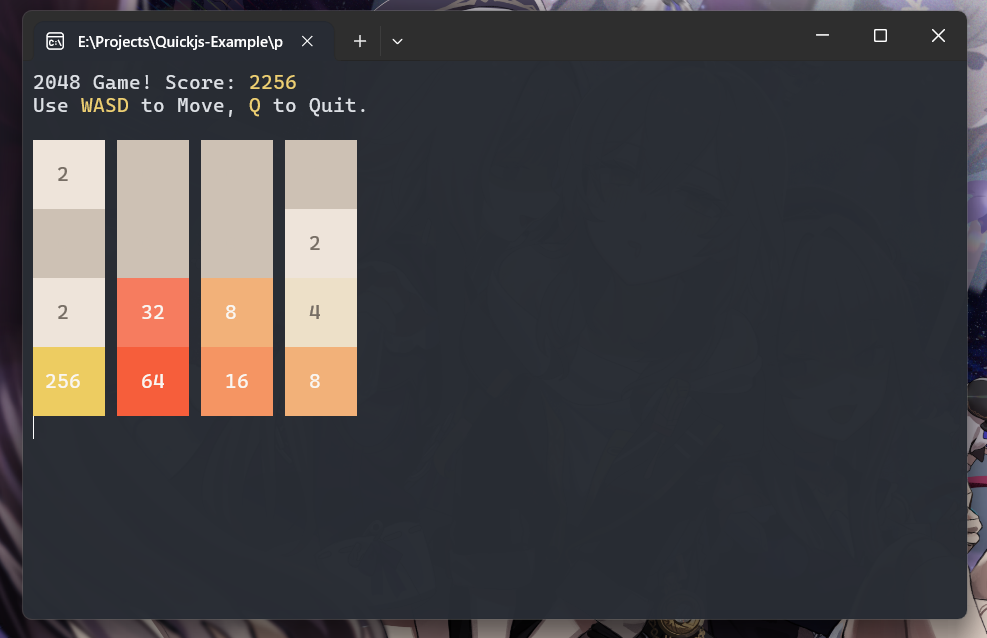
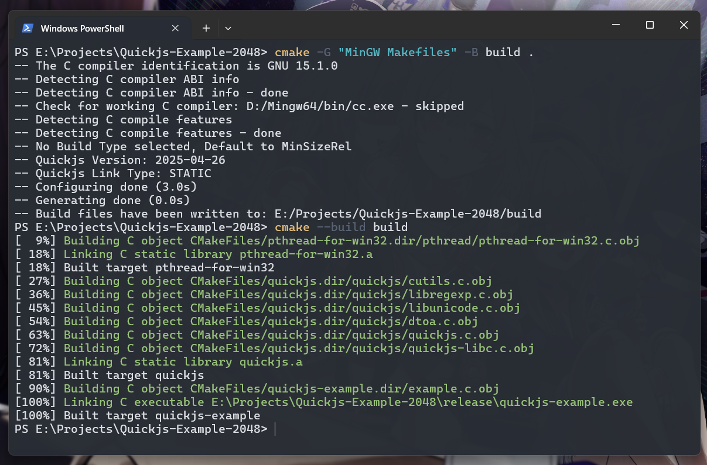
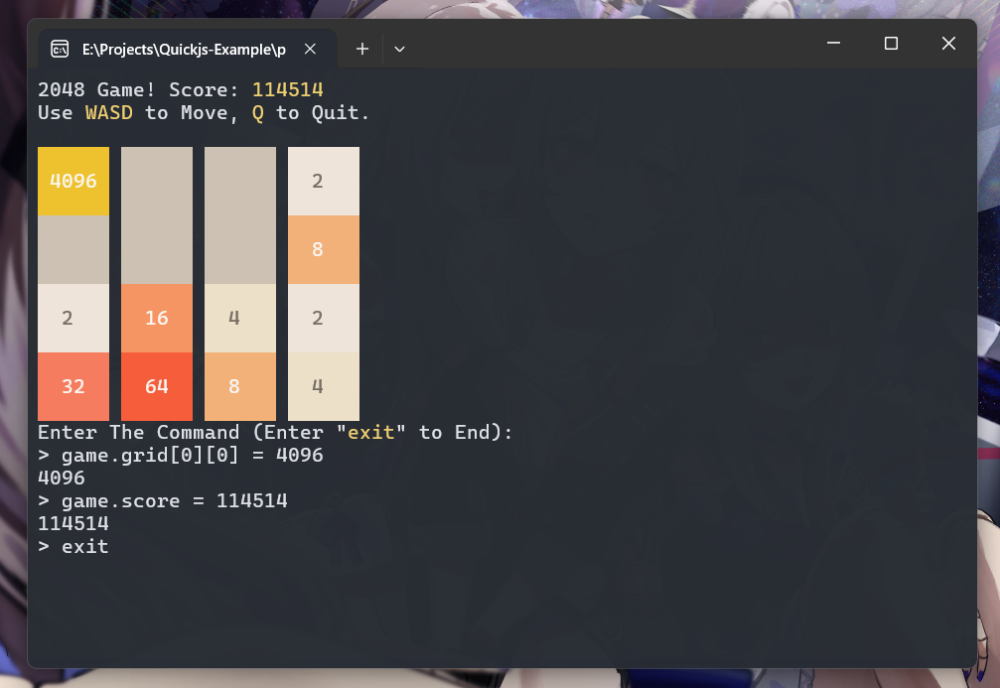

# Quickjs-Example-2048
基于 **C语言** + **Quickjs** 制作的控制台版2048游戏，作为 **Quickjs** 的示例程序



## 环境要求
1. 仅适用于 **Windows** 平台

2. 仅适用于 **Windows 10** 及以上版本的系统

## 使用方法
1. 从 [Release](https://github.com/SyrieYume/Quickjs-Example-2048/releases/latest) 下载 `quickjs-example-2048.zip`, 解压到任意位置

2. 运行其中的 `quickjs-example.exe`

3. **W A S D** 键控制游戏，**Q**键退出

## 如何编译本项目
1. 需要安装 [**CMake**](https://cmake.org) (cmake version 4.1.0)，或者根据 `CMakeLists.txt` 自己写编译指令

2. 需要安装 [**MinGW-w64**](https://www.mingw-w64.org) (gcc version 14.2.0)，**Clang** 应该也可以，不过我没测试过

3. 在项目根目录下依次执行以下指令：
```powershell
cmake -G "MinGW Makefiles" -B build .
cmake --build build
```

4. 生成的程序在 `release` 目录下的 `quickjs-example.exe`，程序运行的时候，需要保证程序和 `example.js` 文件处于同一个目录下

5. 可以选择动态链接 **程序** 和 **quickjs**，生成 `quickjs-example.exe` 和 `quickjs.dll` 两个文件：
```powershell
cmake -G "MinGW Makefiles" -B build . -DDYNAMIC_LINK_QUICKJS=ON
cmake --build build
```



## 程序中的小彩蛋🍰
程序运行时，按下 **"/"** 键可以输入并执行js代码来修改游戏，例如输入：
```javascript
game.grid[0][0] = 1024
```
可以将第1行第1列的方块的值修改为1024

